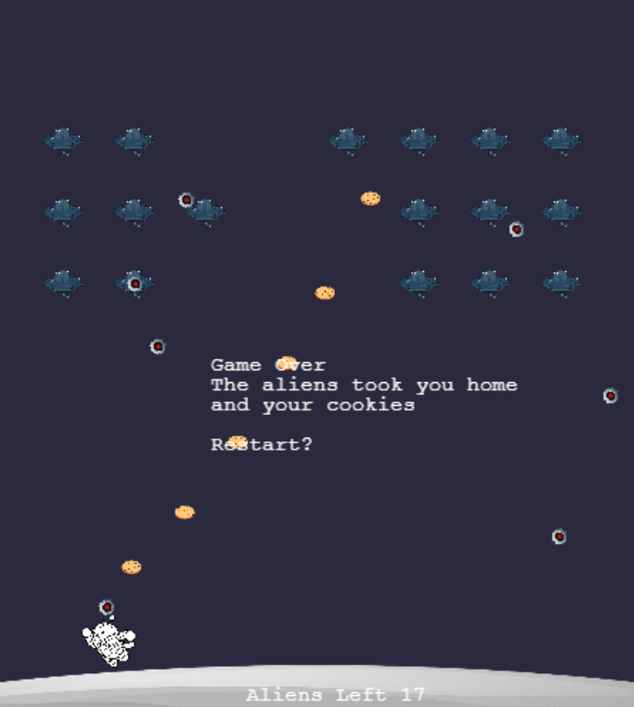

# Phaser.Js Games
Collection of games using the Game Js framework "Phaser.js"

## Get Started
1. **Clone the Repository**

   ```sh
   git clone https://github.com/tynip/PhaserJs_Games.git
   cd PhaserJs_Game

2. **Run HTML file**


## Games
### Aliens vz Michis

You're a cat moon warrior who lives in the moon. You must protect the moon from the evil aliens who want to take your home and your cookies. 

- Space to shoot
- Arrows to move

To win you must eliminate all aliens.


### Flappy Bird 
(Under development)

## References
All assets used from [PixaBay](https://pixabay.com/es/)
